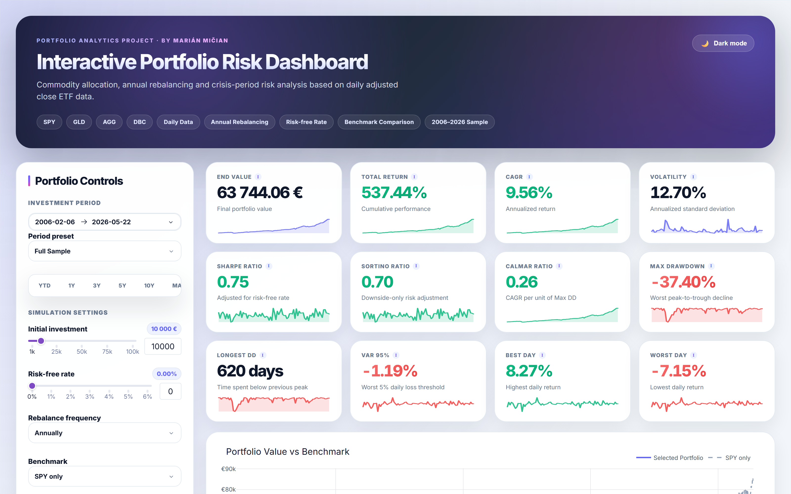
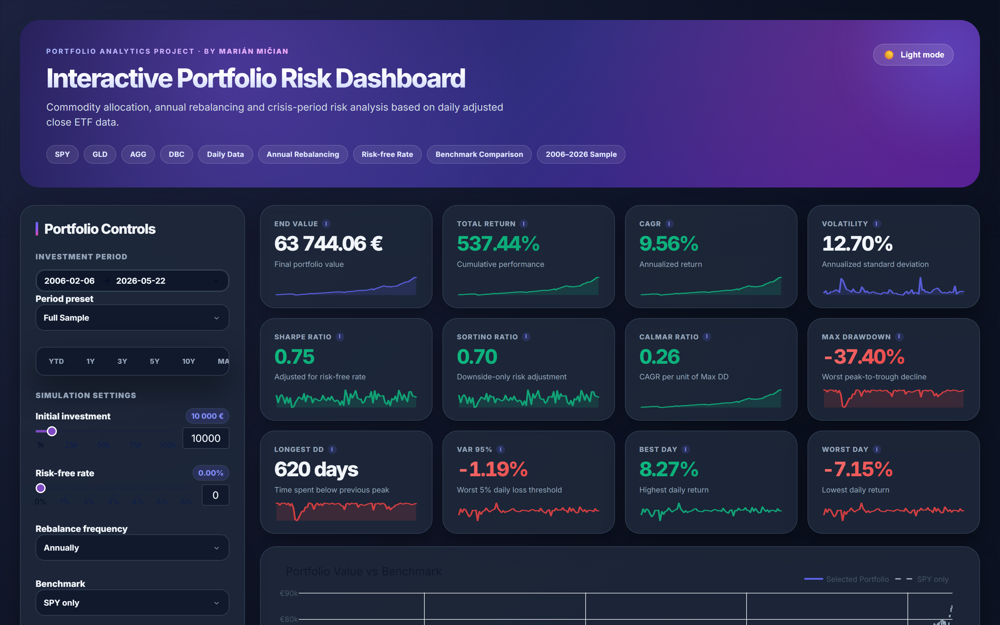
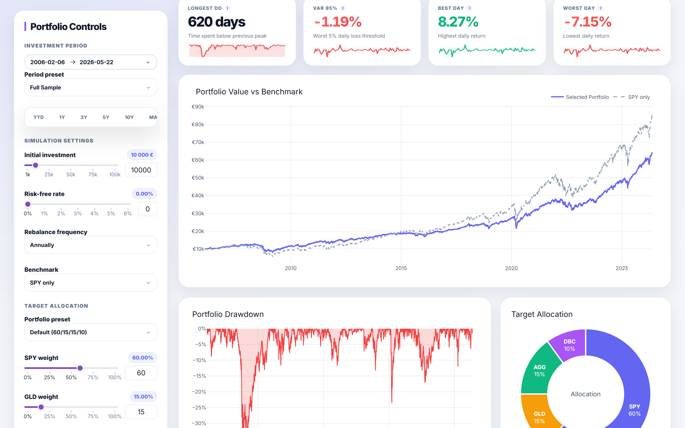
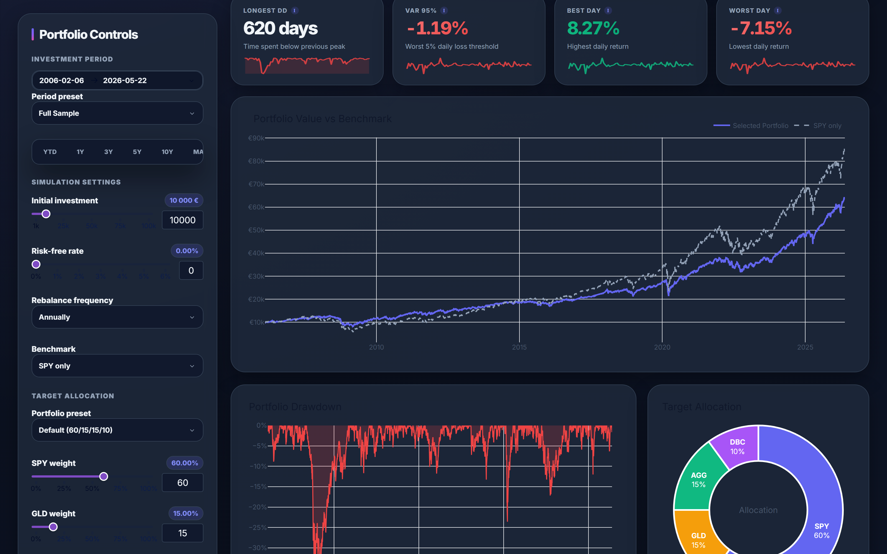
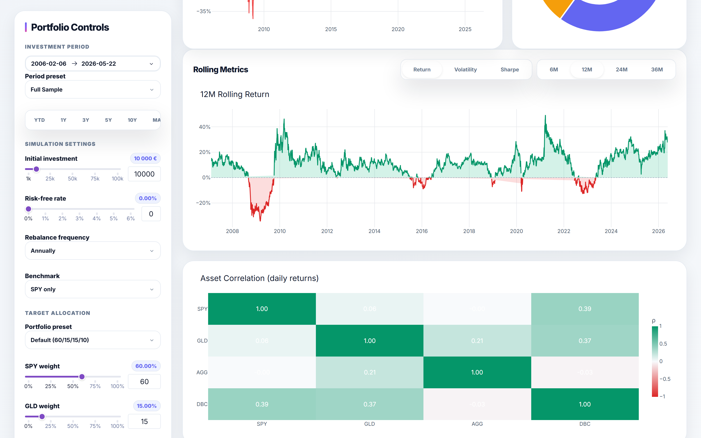
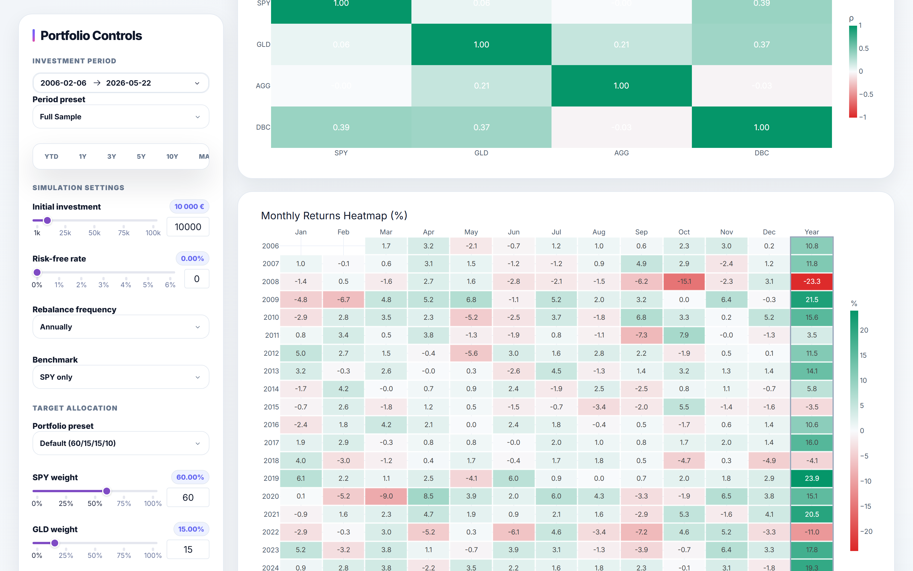

# Interactive Portfolio Risk Dashboard

A modern, interactive backtesting and risk-analysis dashboard for a 4-ETF multi-asset portfolio (SPY · GLD · AGG · DBC) — built with **Python**, **Dash** and **Plotly**.

> **Built by [Marián Mičian](https://github.com/<your-user>)** · [Live demo →](https://portfolio-risk-dashboard-marian-mician.onrender.com)



[](https://render.com/deploy)

---

## ✨ Features

### Core analytics
- **12 risk metrics** with tooltips — End Value, CAGR, Volatility, Sharpe, Sortino, Calmar, Max Drawdown, Longest Drawdown, VaR 95%, Best/Worst Day
- **Annual / Quarterly / Monthly / No rebalancing** — switch on the fly
- **Crisis-period stress table** — Global Financial Crisis, COVID-19 Shock, 2022 Inflation
- **Benchmark comparison** — SPY only, 60/40, Equity+Gold, custom

### Charts
- **Portfolio Value vs Benchmark** time series
- **Drawdown** underwater chart
- **Target Allocation** donut
- **Asset Correlation** heatmap (4×4)
- **Monthly Returns** heatmap (year × month + yearly totals column)
- **Rolling Metrics** — switchable Return / Volatility / Sharpe over 6M / 12M / 24M / 36M windows
- **Monte Carlo Forecast** — bootstrap simulation (500–5000 paths) over 5–30Y horizons with 5/25/50/75/95 percentile fan chart
- **12 inline sparklines** in metric cards

### UX
- **Dark / Light mode** toggle (preference saved to `localStorage`)
- **Date quick-range buttons** — YTD / 1Y / 3Y / 5Y / 10Y / MAX
- **Portfolio presets** — All Weather (Ray Dalio), Permanent Portfolio, Golden Butterfly, Equal Weight, Conservative, Aggressive Growth
- **Shareable URL** — Copy share link button encodes the full configuration to a query string
- **Loading spinners** on every chart for visual feedback
- **Modern dashboard look** — gradient accents, glow hover, glassmorphism, tabular numerals

### Performance
- **`@lru_cache`** on price loading + portfolio rebalancing → **~680× speed-up** on cached calls (412 ms → 0.6 ms)
- Daily ETF data auto-refreshed weekly via **GitHub Actions** (`download_daily_data.py` runs every Saturday after market close)

---

## 🖼️ Gallery

| Light mode | Dark mode |
|---|---|
|  |  |
|  |  |

| Heatmaps | Monte Carlo Forecast |
|---|---|
|  |  |

---

## 🧰 Tech stack

- **[Dash 3](https://dash.plotly.com/)** — Python web framework
- **[Plotly](https://plotly.com/python/)** — interactive charts
- **pandas / NumPy** — data layer
- **[yfinance](https://github.com/ranaroussi/yfinance)** — historical price feed
- **gunicorn** — production WSGI server
- **GitHub Actions** — weekly data refresh
- **Render.com** — free deployment target

---

## 🚀 Run locally

```bash
git clone https://github.com/<your-user>/portfolio-risk-dashboard.git
cd portfolio-risk-dashboard

python -m venv .venv
.venv\Scripts\activate          # Windows
# source .venv/bin/activate      # macOS / Linux

pip install -r requirements.txt
python app_fixed.py
```

Then open <http://localhost:8050>.

To force a fresh download of the daily ETF prices:

```bash
python download_daily_data.py
```

---

## ☁️ Deploy to Render (free, ~3 clicks)

> **📘 Full step-by-step guide:** see [DEPLOYMENT.md](DEPLOYMENT.md) for a 15-minute walkthrough from `git init` to live URL, including troubleshooting.

This repo ships with a `render.yaml` blueprint, so deploying is one of:

**Option A — Blueprint (recommended):**

1. Push this repo to GitHub.
2. Go to <https://dashboard.render.com/blueprints> → **New Blueprint Instance** → connect the repo.
3. Render reads `render.yaml`, provisions a free Web Service, builds, and deploys.
4. Your URL: `https://portfolio-risk-dashboard-marian-mician.onrender.com`

**Option B — Manual:**

1. New → **Web Service** → connect the repo.
2. Settings:
   - **Build command:** `pip install -r requirements.txt`
   - **Start command:** `gunicorn app_fixed:server --bind 0.0.0.0:$PORT --workers 1 --threads 4 --timeout 120`
   - **Runtime:** Python 3.12
   - **Plan:** Free
3. Deploy.

> Free Render Web Services spin down after 15 min of inactivity. First request after sleep takes ~30 s to wake the dyno. Subsequent requests are instant. For zero cold starts, upgrade to the $7 / month "Starter" plan.

---

## 📅 Weekly data refresh (GitHub Actions)

`.github/workflows/refresh-data.yml` re-runs the yfinance download every **Saturday 06:00 UTC** and commits new CSVs back to the repo if anything changed. Render then auto-redeploys on push, so the live app stays fresh without manual work.

Trigger manually anytime: **Actions → Refresh daily ETF data → Run workflow**.

---

## 🧪 Project layout

```
.
├── app_fixed.py              # Dash app, layout & callbacks
├── portfolio_engine.py       # Pricing, rebalancing, metrics, Monte Carlo
├── download_daily_data.py    # yfinance refresh script
├── assets/
│   └── styles_fixed.css      # CSS tokens, dark mode, gradient accents
├── data/
│   ├── daily_adjusted_prices_all.csv
│   └── daily_adjusted_prices_common.csv
├── scripts/
│   └── capture_screenshots.py  # Playwright helper for docs/
├── docs/
│   └── screenshots/          # README images
├── .github/workflows/
│   └── refresh-data.yml      # Weekly cron
├── render.yaml               # Render blueprint
├── Procfile                  # Alternate process declaration
├── runtime.txt               # Python version pin
└── requirements.txt
```

---

## 📝 Notes & design decisions

- **Bootstrap Monte Carlo** (sampling with replacement from realized daily returns) is used instead of a parametric GBM. It captures real-world fat tails without assuming normality.
- **CSS custom properties** drive the whole theme — adding a new colour mode is ~30 lines of overrides.
- **`@lru_cache` keyed on weights + date range + file mtime** — file changes invalidate cache automatically.
- **Sparklines** are pure inline SVG encoded as base64 data URIs — no JS dependency, no extra HTTP requests.

---

## 👤 Author

**Marián Mičian**

If you find this useful, a ⭐ on the repo is appreciated.

---

## 📄 License

MIT. Data via Yahoo Finance through `yfinance` — for personal / educational use; not investment advice.
