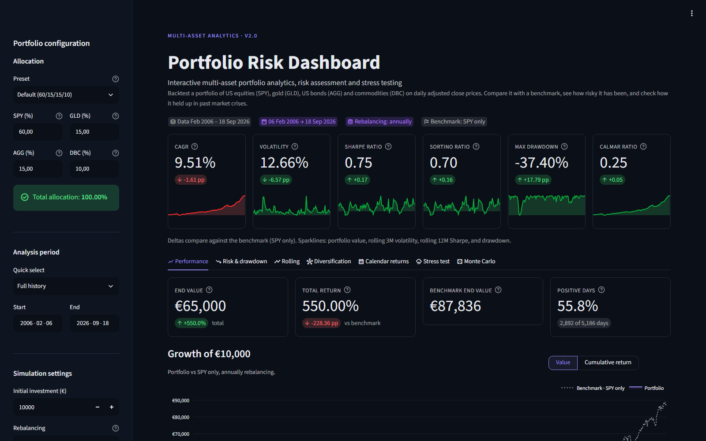
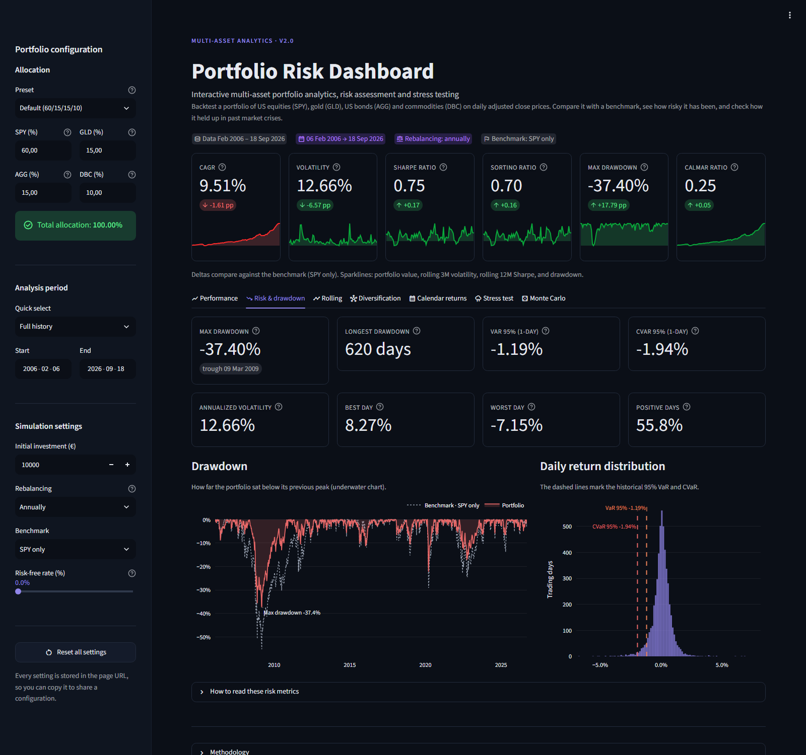
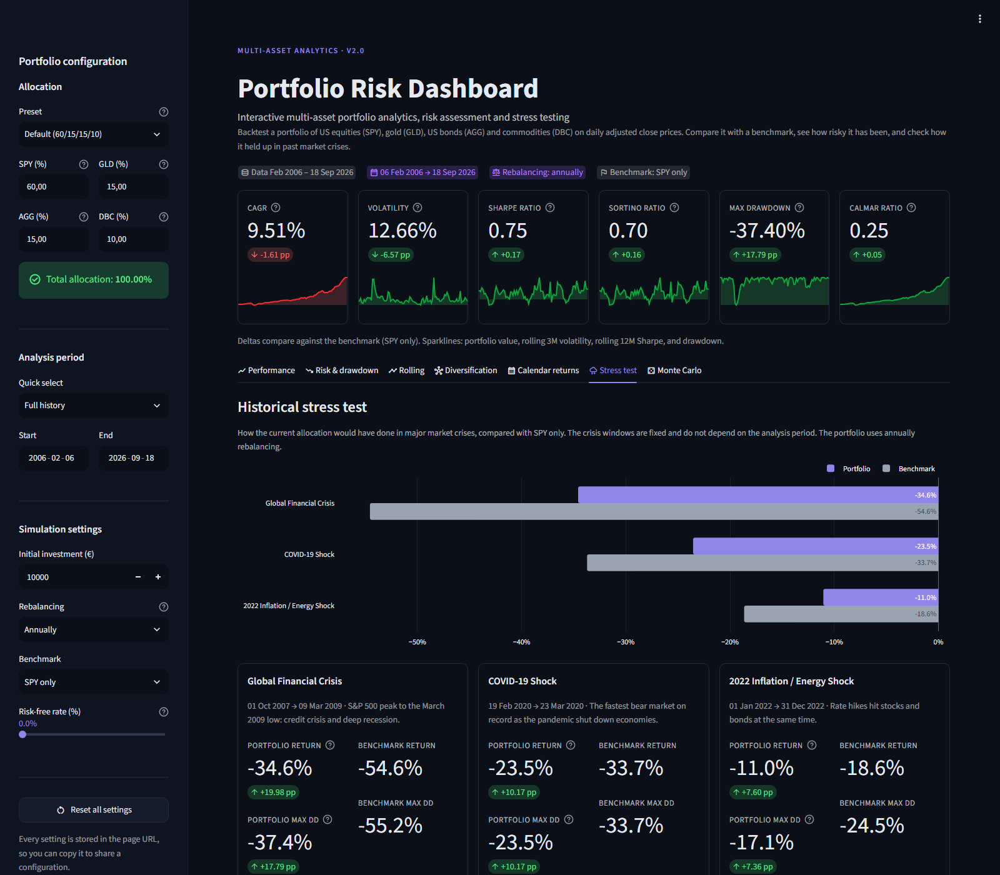
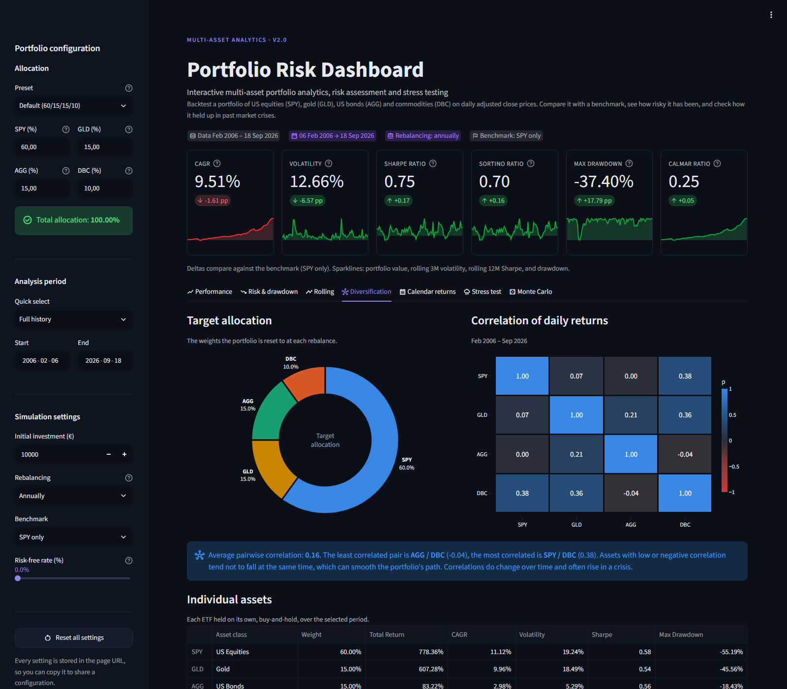
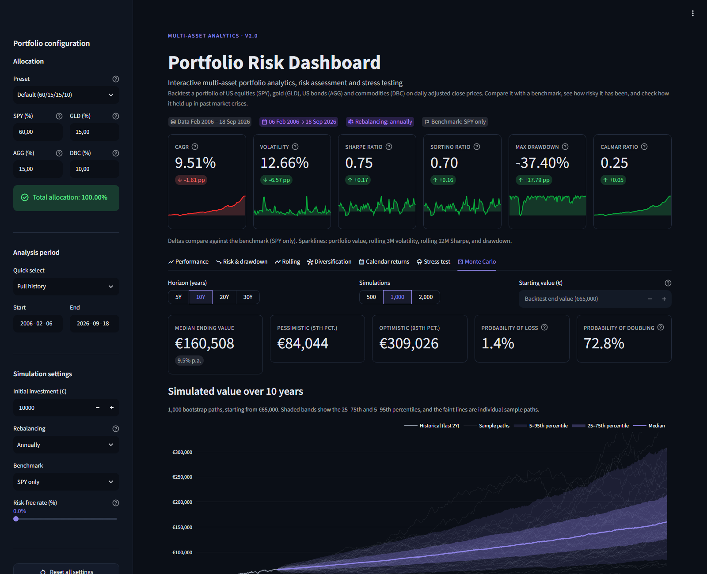

# Portfolio Risk Dashboard

**Interactive multi-asset portfolio analytics, risk assessment and stress testing, built with Python and Streamlit.**



> Built by **Marián Mičian** · [Source code](https://github.com/Majky211337/portfolio-risk-dashboard-marian.mician)

---

## Overview

Portfolio Risk Dashboard is an interactive tool for backtesting a four-asset ETF portfolio. You choose the weights of US equities, gold, bonds and commodities, a rebalancing rule, an analysis period and a benchmark. The dashboard then shows how the portfolio performed, how risky it was, how its assets moved together, how it behaved in past market crises, and what range of futures a bootstrap Monte Carlo simulation suggests.

All calculations run on locally stored daily adjusted close prices, so the app loads instantly and never depends on a live market-data API. A scheduled GitHub Action refreshes the data every week.

## Features

- **Portfolio configuration**: seven classic presets (60/15/15/10, All Weather, Permanent Portfolio, Golden Butterfly, Equal Weight, Conservative, Aggressive Growth) or custom weights. Weights are **validated to total 100%**, and no results are shown until they do. A *Normalize weights* button rescales them explicitly; weights are never adjusted silently.
- **Rebalancing**: never, monthly, quarterly or annually.
- **Analysis period**: any date range, plus shortcuts (YTD, 1Y–10Y, full history, and each crisis window).
- **Benchmarks**: SPY only, 60/40, SPY + AGG (70/30) and SPY + GLD (80/20).
- **Headline KPIs**: CAGR, volatility, Sharpe, Sortino, max drawdown and Calmar, each with its difference vs the benchmark and a sparkline.
- **Performance**: growth of the initial investment (as value or cumulative return) against the benchmark, and a side-by-side table of every metric.
- **Risk & drawdown**: underwater chart, daily return distribution with VaR / CVaR markers, longest drawdown, and best and worst days.
- **Rolling analytics**: rolling return, volatility or Sharpe over 6M, 12M, 24M or 36M windows, against the benchmark.
- **Diversification**: allocation donut, correlation heatmap with an automatic summary, and stand-alone statistics for each ETF.
- **Calendar returns**: monthly returns heatmap with yearly totals, and calendar-year returns against the benchmark.
- **Historical stress test**: portfolio vs benchmark return, max drawdown and volatility in the Global Financial Crisis, the COVID-19 crash and the 2022 inflation shock, with a path chart for each.
- **Monte Carlo**: bootstrap simulation (500–2,000 paths, 5–30 years) with a percentile fan, sample paths, median / 5th / 95th percentile outcomes, and the probability of loss or of doubling.
- **Shareable configurations**: every setting is stored in the URL, so you can copy the address bar to share an exact scenario.

| Risk & drawdown | Stress test |
|---|---|
|  |  |
| **Diversification** | **Monte Carlo** |
|  |  |

## Asset universe

| Ticker | Asset class | Instrument |
|---|---|---|
| **SPY** | US equities | SPDR S&P 500 ETF Trust: 500 large-cap US companies |
| **GLD** | Gold | SPDR Gold Shares: physically backed gold |
| **AGG** | US bonds | iShares Core US Aggregate Bond ETF: investment-grade US bonds |
| **DBC** | Commodities | Invesco DB Commodity Index Tracking Fund: energy, metals and agriculture futures |

Prices are daily **adjusted** closes, so dividends and distributions are included. The sample starts on 6 Feb 2006, the first date on which all four ETFs trade.

## Analytics

| Metric | Definition used |
|---|---|
| **CAGR** | `(end / start) ^ (1 / years) − 1`, where years = calendar days ÷ 365.25 |
| **Volatility** | standard deviation of daily returns × √252 |
| **Sharpe ratio** | `(CAGR − risk-free rate) / volatility` |
| **Sortino ratio** | `(CAGR − risk-free rate) / downside deviation`, where downside deviation = `sqrt( mean( min(rₜ − rf_daily, 0)² ) ) × √252`, with `rf_daily = (1 + rf)^(1/252) − 1` and the mean taken over **all** trading days (days above the target count as zero). This is the conventional target downside deviation.* |
| **Maximum drawdown** | largest peak-to-trough fall in portfolio value |
| **Calmar ratio** | `CAGR / |max drawdown|` |
| **VaR 95%** | historical one-day Value-at-Risk: the 5th percentile of daily returns |
| **CVaR 95%** | expected shortfall: the average of daily returns at or below the VaR |
| **Correlation** | Pearson correlation of the ETFs' daily returns over the selected period |
| **Stress testing** | the portfolio and benchmark backtested inside fixed historical crisis windows |
| **Monte Carlo** | resampling of the portfolio's historical daily returns with replacement (bootstrap), fixed seed |

\* *Methodology change in v2.0:* v1 averaged the squared shortfalls over the downside days only. That understated Sortino by a factor of √(share of downside days), about 0.67 for this dataset, which put it below the Sharpe ratio for the portfolios tested. For the default 60/15/15/10 portfolio (full history, annual rebalancing, rf = 0), Sortino changes from 0.70 (v1) to 1.06 (v2). All other metrics are unchanged from v1.

**Backtest mechanics:** the portfolio starts at its target weights. Each holding then drifts with its own daily returns, and the weights are reset on the first trading day of each new month, quarter or year, depending on the rebalancing rule.

## Technology

- **Python 3.12+**
- **Streamlit**: UI, caching (`st.cache_data`), fragments, and URL-bound widgets
- **pandas / NumPy**: data handling and vectorized portfolio calculations
- **Plotly**: interactive charts
- **yfinance**: historical price download (data refresh only)
- **GitHub Actions**: weekly automated data refresh

## Project structure

```text
.
├── app.py                     # Streamlit entry point: page layout and tabs
├── portfolio_engine.py        # Calculation engine (no UI code): backtest, metrics, stress tests, Monte Carlo
├── dashboard/
│   ├── analytics.py           # Cached wrappers around the engine
│   ├── charts.py              # Plotly figure builders
│   ├── config.py              # Assets, presets, benchmarks, crisis periods, colours
│   ├── sidebar.py             # Sidebar controls and input validation
│   └── ui.py                  # Formatting helpers and minimal CSS
├── download_daily_data.py     # Yahoo Finance → data/*.csv
├── data/                      # Daily adjusted close prices (CSV + XLSX)
├── .streamlit/config.toml     # Dark theme
├── .github/workflows/refresh-data.yml
├── scripts/capture_screenshots.py
├── requirements.txt           # App dependencies
└── requirements-data.txt      # Data-refresh dependencies
```

## Running locally

```bash
git clone https://github.com/Majky211337/portfolio-risk-dashboard-marian.mician.git
cd portfolio-risk-dashboard-marian.mician

python -m venv .venv
source .venv/bin/activate        # Windows: .venv\Scripts\activate

pip install -r requirements.txt
streamlit run app.py
```

The app opens at <http://localhost:8501>.

To refresh the price data manually:

```bash
pip install -r requirements-data.txt
python download_daily_data.py
```

The engine can also be run as a quick command-line check: `python portfolio_engine.py`.

## Testing

A pytest suite (312 tests) validates the data and every calculation:

```bash
pip install -r requirements-dev.txt
pytest                              # full suite, ~2 minutes
pytest -m "not network"             # skip the live Yahoo Finance comparison
pytest -m "not network and not app" # engine only, no Streamlit app runs
```

| File | What it checks |
|---|---|
| `test_data_integrity.py` | tickers, sorted/unique dates, no NaN, positive prices, no impossible or stale moves, the common-date dataset |
| `test_source_data.py` | stored prices vs a fresh Yahoo Finance download (adjusted-close definitions, levels and returns) |
| `test_backtest.py` | single-asset paths, SPY vs benchmark, weight reset and drift for each rebalancing rule, scaling with the initial investment |
| `test_metrics.py` | every metric recomputed with independent NumPy formulas, including a Sortino deep-dive |
| `test_stress.py` | crisis windows, NYSE trading-day subsets, the selected rebalancing rule, benchmark methodology |
| `test_monte_carlo.py` | fixed-seed reproducibility, dimensions, return (not price) resampling, percentile ordering |
| `test_regression.py` | 140 scenarios bitwise-identical to the original v1 engine (frozen in `tests/legacy/`); Sortino is checked against the exact v1 → v2 conversion instead |
| `test_edge_cases.py` | invalid weights, dates, empty or missing data, both in the engine and in the running app |

## Deployment

The app is designed for **[Streamlit Community Cloud](https://streamlit.io/cloud)**:

1. Push the repository to GitHub.
2. Sign in at <https://share.streamlit.io> with your GitHub account.
3. Click **Create app** → **Deploy a public app from GitHub**.
4. Select the repository, branch `main`, and main file path `app.py`.
5. Optionally, under **Advanced settings**, choose Python 3.12 and a custom subdomain.
6. Click **Deploy**.

Streamlit Community Cloud installs `requirements.txt` and redeploys automatically on every push to `main`.

### Automated data refresh

`.github/workflows/refresh-data.yml` runs every **Saturday at 06:00 UTC**, and can also be started from **Actions → Refresh daily ETF data → Run workflow**. It downloads fresh prices, commits the CSVs if they changed, and that push triggers a redeploy:

```text
Yahoo Finance → GitHub Action → data/*.csv committed → Streamlit Cloud redeploys → app reads CSV
```

If Yahoo Finance is unavailable, the workflow fails without committing anything, and the app keeps serving the last good dataset. The workflow needs **Settings → Actions → General → Workflow permissions → Read and write permissions**.

## Disclaimer

This dashboard is for **educational and analytical purposes only** and is **not investment advice**. Backtests and simulations use historical data and do not guarantee future results. Market data comes from Yahoo Finance via `yfinance` and may contain errors.

## License

MIT
